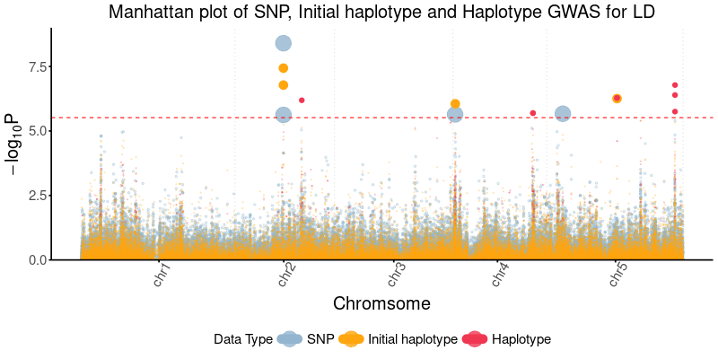

<!-- README.md is generated from README.Rmd. Please edit that file -->

# GWAS2

<!-- badges: start -->
<!-- badges: end -->

The goal of GWAS2 is to perform Haplotype-based GWAS.

## Installation

You can install the development version of GWAS2 from
[GitHub](https://github.com/) with:

``` r
# install.packages("devtools")
devtools::install_github("qj009/GWAS2")
```

## Example

This is a basic example which shows you how to solve a common problem:

### Load GWAS2 package into environment

``` r
library(GWAS2)
```

### Load example Arabidopsis data:

``` r
library(googledrive)
# genotype data
GEN_ID <-  drive_get(as_id("1VPLHa9QWiiey4N5jaUOc516xXo22_fVi"))
drive_download(GEN_ID, overwrite = TRUE)
(load(file="GEN.rda"))

# phenotype data
Y_ID <-  drive_get(as_id("1AF3XGQr-MwsR928NRLM5X6SwYx20NcUA"))
drive_download(Y_ID, overwrite = TRUE)
(load(file="Y.rda"))
```

### Prepare data for GWAS:

Generate biallelic genotype matrix from original dataset:

``` r
GEN.GG <- GEN[,-(1:2)]
gg<-GG(GEN.GG)
```

Generate numerical format genotype matrix from biallelic data:

``` r
xx<-GEN.CODE(gg)
```

Calculate kinship matrix:

``` r
kin<-KIN(xx)
```

Generate SNP map file

``` r
CP<-matrix(as.numeric(GEN[,1:2]),nrow(GEN),2)
```

Generate genotype matrix used for GWAS

``` r
gen<-cbind(CP,gg)
```

Generate phenotype matrix used for GWAS:

``` r
YFIX <- as.matrix(Y[,2:3])
```

Define association model:

``` r
method<-"RANDOM"
```

Calculate initial parameters for association test

``` r
PAR<-TEST.SCAN(YFIX,NULL,KIN=kin,method,NULL)
```

### SNP-based GWAS:

``` r
snp_scan <- SEL.SNP(gen, YFIX, KIN=kin, method, PAR=PAR)
```

### Haplotype-based GWAS:

``` r
CN <- 16471 # Effective number of markers
P.threshold = 1/CN
RR.MULTI<-SEL.HAP(MAP.S=NULL, POS.S=NULL,GEN=gen, 
                  YFIX=YFIX, KIN=kin, nHap=2,method=method, 
                  p.threshold=P.threshold, RR0=NULL,TEST=c(1,2),PAR=PAR)
```

Initial haplotype test result:

``` r
WALD.HapInitial<-RR.MULTI[[2]][[1]]
LRT.HapInitial<-RR.MULTI[[2]][[2]]
```

Haplotype final result:

``` r
WALD.FINAL<-RR.MULTI[[1]][[1]]
LRT.FINAL<-RR.MULTI[[1]][[2]]
```

### Visulization:

Here we take results based on Wald test as an example.

Generate map file of SNP and Haplotype-based GWAS result:

SNP

``` r
snp <- as.data.frame(snp_scan[[1]])
snp_map <- snp %>% dplyr::select(X1,X2,X5) %>% mutate(id = paste0("chr",X1,":",X2))
colnames(snp_map) <- c("chr", "pos","p","id")
```

Initial Haplotype

``` r
hapi <- WALD.HapInitial
hapi_map <- hapi %>% dplyr::select(X1,X4,X5,X8) %>% mutate(id = paste0("chr",X1,":",X4,"_",X5))
colnames(hapi_map) <- c("chr", "start","end","p","id")
```

Final Haplotype

``` r
hap <-WALD.FINAL
# generate haplotype length which means the number of SNPs this haplotype contains. 
hap_map <- hap %>% mutate(Hap_length = X3-X2+1) %>% select(X1,X4,X5,X8,Hap_length) %>% mutate(id = paste0("chr",X1,":",X4,"_",X5))  
colnames(hap_map) <- c("chr", "start","end","p","Hap_length","id")

# remove di-SNPs (initial result) in final FINAL haplotype result
hap_map <- hap_map %>% dplyr::filter(Hap_length>=3)%>% dplyr::select(-Hap_length)
```

Generate combined Manhattan plot:

``` r
T.Name = "LD"
sig_line = 3E-06
ylim = c(0,9)

vis(T.Name, snp_map, hapi_map, hap_map, sig_line=sig_line, ylim)
```


[Download the
PDF](https://drive.google.com/file/d/1W0hsMJW0k8fLVR58KOr3Vt21iiJhDIsQ/view?usp=drive_link)
